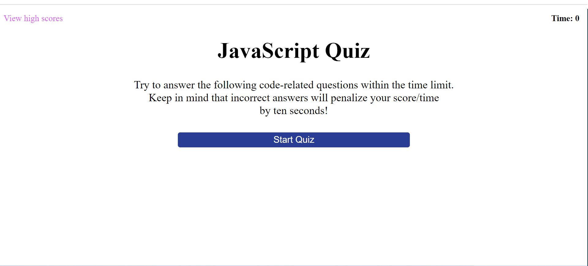

# JavaScript Quiz  

  

[Take the Quiz](https://michaelwwalker42.github.io/JavaScript-Quiz/)
## Description
A timed coding quiz with multiple-choice questions. The app runs in the browser and features dynamically updated HTML and CSS. This bootcamp challenge was my first introduction to JavaScript timing events. 

## User Story
**AS A** coding boot camp student  
**I WANT** to take a timed quiz on JavaScript fundamentals that stores high scores  
**SO THAT** I can gauge my progress compared to my peers  
## Acceptance Criteria
**GIVEN** I am taking a code quiz  
**WHEN** I click the start button  
**THEN** a timer starts and I am presented with a question  
**WHEN** I answer a question  
**THEN** I am presented with another question  
**WHEN** I answer a question incorrectly  
**THEN** time is subtracted from the clock  
**WHEN** all questions are answered or the timer reaches 0  
**THEN** the game is over  
**WHEN** the game is over  
**THEN** I can save my initials and score  
## Questions
My Github Profile: [michaelwwalker42](https://github.com/michaelwwalker42)  
For additional questions email me at michaelwwalker42@gmail.com 